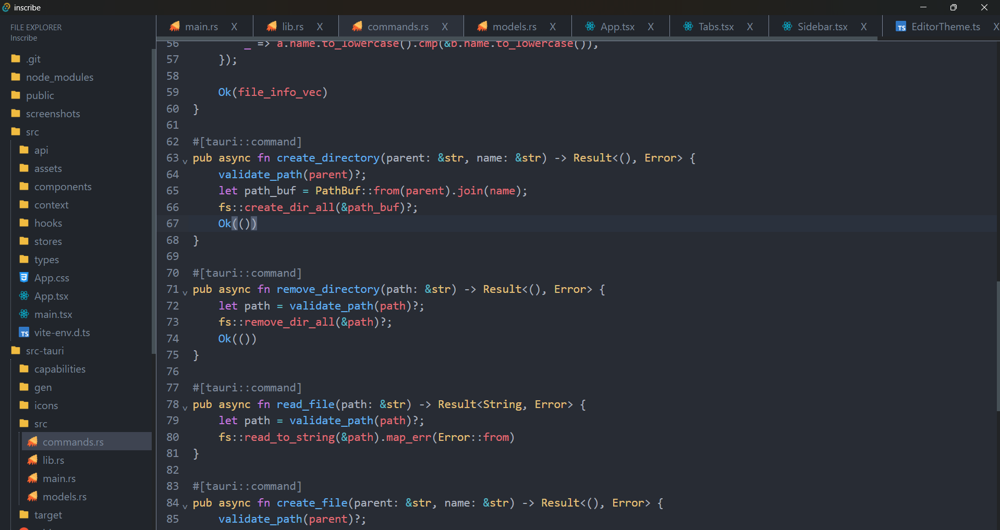

# Inscribe

**Inscribe** is a lightweight and user-friendly code editor built with Tauri, designed to enhance your coding experience. With a clean interface and essential features, Inscribe helps you focus on writing code effortlessly.




## Tech Stack

- **Tauri:** A framework for building smaller, faster, and more secure desktop applications.
- **Rust:**  Used for backend logic and performance.
- **React:** Used for building user interfaces.
- **Tailwind CSS:** Used for styling and layout.

## Features

- **Autocompletion:** Get suggestions for code completions to speed up your workflow.
- **Auto Indentation:** Automatically formats your code with consistent indentation.
- **Bracket Matching:** Automatically highlights matching brackets for easier code navigation.
- **Code Folding:** Easily collapse and expand code blocks with the fold keymap.
- **File Explorer:** Open a file explorer to choose a folder and access your files.
- **File Type Detection:** Automatically identify file types for appropriate syntax highlighting and features.
- **Highlight Active Line:** Visually identify the current line you’re working on for better focus.
- **Keyboard Shortcuts:** Navigate and edit your code efficiently with customizable keymaps.
- **Line Numbers:** Keep track of your code with visible line numbers.
- **Syntax Highlighting:** Easily read and understand your code with color-coded syntax.
- **Tabs for Multiple Files:** Work on multiple files simultaneously with tabbed editing.
- **Undo/Redo:** Quickly revert or reapply changes with undo and redo functionality.
- **Create new File/Folder:** Create a new file or folder
- **Rename files or folders:** Rename files or folders


## Installation

To get started with Inscribe, follow these steps:

1. Clone the repository:
   ```
   git clone https://github.com/Ziad-I/inscribe.git
   ```

2. Navigate to the project directory:
   ```
   cd inscribe
   ```

3. Install dependencies:
   ```
   npm install
   ```

4. Run the application in development mode:
   ```
   npm run tauri dev
   ```

5. Build the application for production:
   ```
   npm run tauri build
   ```

## Usage

To use **Inscribe**, open the application and click on the file explorer to choose a folder. Once selected, you can create, edit, and save files within that folder. You can also open multiple files at once using tabs for a more organized workflow.

## Contributing

Contributions are welcome! If you'd like to contribute, please follow these steps:

1. Fork the repository.
2. Create a new branch for your feature or bug fix.
3. Make your changes and commit them.
4. Push to your branch and open a pull request.

## License

This project is licensed under the MIT License. See the [LICENSE](LICENSE) file for details.

## TODO

- [x] Create a custom context menu to allow the creation of folders/files and renaming.
- [ ] replace the browser's native prompt() with something prettier.
- [ ] Allow users to change the theme.
- [ ] Add image preview.
- [ ] Add an embedded terminal.

